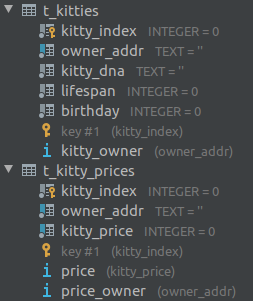
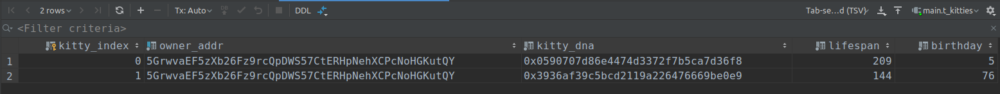
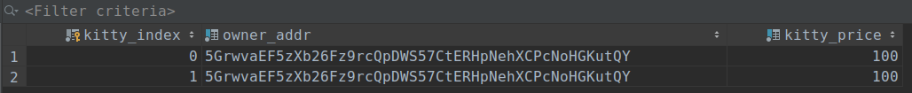

# WhatSubs

## 需求

### 小猫在一定的年龄范围内才能繁殖
* 小猫的新结构体
```rust
pub struct Kitty<T> where T: Trait {
	pub dna: [u8; 16],
	pub lifespan: T::BlockNumber,
	pub birthday: T::BlockNumber,
}
```
* 所有的时间都使用区块数量来表示. 
* 小猫有最大和最小的繁殖年龄. 只有在这个范围内才可繁殖. 
* 通过注入的方式进行配置
```rust
pub trait Trait: system::Trait {
	//...
	// 最大生育年龄
	type MaxBreedingAge: Get<Self::BlockNumber>;
	// 最小生育年龄
	type MinBreedingAge: Get<Self::BlockNumber>;
	//...
}
```
* 在`decl_error!`中加了若干错误

### 年龄太大的小猫会死亡
* 小猫的`寿命`是随机的. `寿命 = (最小生育年龄 + 最大生育年龄) / 2 + u32随机数 % 年龄最大增量`
* `年龄最大增量`的配置是注入的
```rust
pub trait Trait: system::Trait {
	// ...
	// 要随机增加的年龄的最大值
	type MaxLifespanDelta: Get<Self::BlockNumber>;
}
```
* 小猫创建时, 会添加一个死亡标记  
`pub KittyTombs get(fn kitty_tombs): double_map T::BlockNumber, T::KittyIndex => Option<T::KittyIndex>;`
* 在`on_initialize`回调中, 删除在本块死亡的小猫.
* 创建标记和查找标记得益于`double_map`的`key`前缀操作. 
* 在`decl_event!`中增加死亡事件

### 其他
* 在 `runtime/src/linked_item.rs` 中增加了个方法, 用于分页读取数据.
* 增加了大量单元测试. 
* 使用`polkadot.js.org/apps`  
  在`https://polkadot.js.org/apps/#/settings/developer`中配置:
```json
{
  "Kitty": {
    "dna": "[u8;16]",
    "lifespan": "u32",
    "birthday": "u32"
  },
  "KittyIndex": "u32",
  "KittyLinkedItem": {
    "prev": "Option<KittyIndex>",
    "next": "Option<KittyIndex>"
  }
}
```

## kitty server 一个中心化服务器
* 接收所有链上事件, 保存于Sqlite3
* 
* 
* 

#### 启动服务器&测试
* 进入项目根目录
* `s/build.sh` # 启动区块链
* `cd cmd`
* `mpn install`
* `make` # 启动中心化服务器, 处理事件
* `make create` # Alice创建猫
* `make create` # Alice创建猫
* `make query` # 对比当前DB和链上数据
* `node src/alice_ask_kitty.js 0 100` # Alice卖第0只猫, 100钱.
* `make query` # 对比当前DB和链上数据
* `node src/bob_buy_kitty.js 0 100` # Bob买猫
* `make query` # 对比当前DB和链上数据
